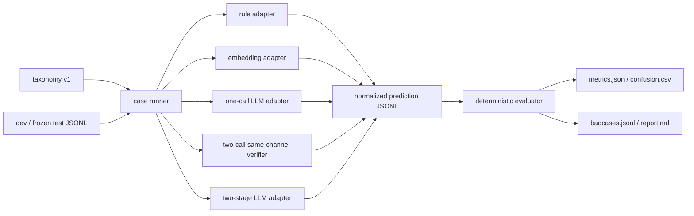
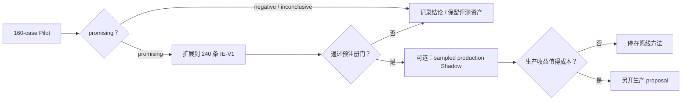

# 求职优先的意图识别 Workbench：数据、基线、OOS 与评测闭环

> 🏛️ **Status**: `targeted re-review closed / design only / implementation not authorized`
>
> 日期：2026-08-20
>
> 本文取代 Kindred 产品仓库中《开放意图形成与 Activity 诚实落地》的**近期实施优先级**；原文继续留在
> Kindred，作为潜在生产架构参考，不复制到本评测仓库。
>
> 关联 Kindred 产品决策：D-030 / D-036 / D-037 / D-038。

## 0. 结论

Kindred 的下一步不应直接改生产 Sense、增加 choice-boundary 双调用、Shadow 存储和 Thought 投影。
这些工作能够改善产品架构，但实现面大、验证周期长，而且最先产出的只是“又一个 LLM Prompt 方案”，
不足以精准证明求职市场真正关心的意图识别能力。

近期主线改为建设一个**离线、可复现、与生产无副作用的 Intent Recognition Workbench**。V1 只评测
“输入中已有可观察意图证据时，系统能否正确 grounding”，不评测“Agent 应该凭空形成哪个自主意图”：

```text
版本化 taxonomy + 金标评测集
            ↓
规则 / 向量 / 单调用 LLM / 双调用计算对照 / 双阶段 LLM
            ↓
ID Macro-F1 / OOS-F1 / hard-negative / slot / latency / cost
            ↓
混淆矩阵 + badcase 归因 + 可复现实验报告
```

第一版只回答一个预先登记的研究问题：

> 在输入已经包含可观察意图证据的 stateful Activity routing 场景中，双阶段“无目录意图表征 + 完整
> 目录 grounding”相比单调用 LLM 和**等调用次数、可比 token 预算**的单通道复核，是否能提升层级正确率、
> OOS/near-OOS 拒识与弱模型稳定性，同时不明显损害已知 Activity、`no_intent`、延迟和成本？

该路线先做 **7～9 个有效工作日、160 条样本的 portfolio pilot**；只有 pilot 值得扩展时，再增加至
240 条、复标、弱模型稳定性和更严格统计，完整规模约 **12～19 个有效工作日**。全过程不改
`src/kindred` 生产路径、不新增 DB、不改变 graph、不接管真实 Activity。无论双阶段结果是 promising、
inconclusive 还是 negative，都能形成有价值的求职材料，实验也不会影响 Kindred 的生活自主性。

## 1. 为什么改重心

### 1.1 原设计的问题

原设计同时处理了：

- 开放意图形成；
- Activity grounding；
- 新 LLM role 与 schema；
- 生产 orchestration；
- Shadow 与可观测；
- 目录外 Thought；
- Web 可见性；
- 多 Provider 失败降级；
- 最终 production authority 切换。

它是一条合理的产品路线，却把“验证算法假设”和“改造生产系统”绑在一起。若结果不好，很难区分是方法
无效、数据不够、模型问题、Prompt 问题还是运行时集成问题；在求职语境里也缺少可以横向比较的数字。

双 Review 还指出一个更根本的问题：**自主选择没有唯一标准答案**。仅凭“晚饭后在家、刚画完图”不能
人工规定 Kindred 下一步就应该刷小红书；休息、散步、继续安静都可能是合法选择。若把标注者偏好写成
唯一 Gold，评测的是“模型是否迎合出题人”，不是 intent recognition，也破坏 Kindred 的自由选择原则。

因此必须分开：

| 任务 | 是否有唯一 Gold | V1 是否实施 |
|---|---|---|
| 已有可观察意图证据 → taxonomy grounding | 有；证据能支持客观判定 | **是** |
| 无明确意图证据 → spontaneous autonomous choice | 没有唯一 Activity Gold | 否，后置为行为评测 |

V1 的“双阶段”不再负责凭空发明一个预定欲望。它只在第一调用中从已有表达、Thought 或明确意图证据中
恢复一个不受目录措辞影响的自由文本意图表示，第二调用再做 grounding。

因此 IE-Pilot **不能证明或修复**生产中的 spontaneous `rest/eat_at_home` formation collapse。它只能回答：
当输入已经存在丰富、明确的意图证据时，单通道是否仍会把它们错误压回 rest/eat，以及双阶段是否改善
这种 grounding collapse。意图形成层本身由 §11.1 的非唯一 Gold 行为评测另行处理。

### 1.2 求职市场真正要看的证据

当前 Agent/NLP 岗位通常不会只问“Prompt 怎么写”，而会继续追问：

1. taxonomy 和标签边界怎么定义；
2. 数据从哪里来，如何标注和防止泄漏；
3. 为什么选这个模型，有哪些 baseline；
4. ID、OOS、模糊意图和多轮上下文分别如何评测；
5. 模型不确定时如何拒识或澄清；
6. 如何做 badcase、混淆矩阵和数据飞轮；
7. 线上如何 Shadow、监控、控制延迟与成本；
8. 模型变弱、类别增多、分布漂移时是否仍稳定。

本项目应先拿出前六项的可复现证据，再决定是否进入生产 Shadow。这样既缩小工作量，也让后续运行时
决策建立在数据上。

## 2. 求职定位

### 2.1 第一目标岗位

V1 主要服务：

- LLM / Agent 应用算法工程师；
- 对话系统与 Agent intent routing 工程师；
- NLP 应用工程师；
- Agent 评测、数据与效果优化工程师。

V1 不声称覆盖：

- 大模型预训练、RLHF 或 Agentic RL；
- 分布式训练与推理内核；
- 语音 ASR、多模态融合；
- 传统 NLU 研究岗所需的完整模型创新或论文复现。

### 2.2 项目应如何准确表述

推荐定位：

> 一个面向 stateful Agent 的 open-set intent recognition 与 execution-aware routing Workbench。它不仅
> 把已有意图证据映射到 Activity 闭集，还显式识别 OOS、no-intent 和 ambiguous，并用只读合同检查验证
> 目标是否属于可执行 taxonomy；它不宣称已经完成真实工具执行或 execution-based evaluation。

不应笼统表述为：

> 我做了一个意图识别模型。

Kindred V1 识别的是 Agent **已经表达或可观察到的**行动意图，不完全等同于客服场景的单句 user intent
classification。把差异讲清楚反而是亮点：传统 NLU 关注 utterance → label，Kindred 还需要处理状态、
自主拒绝、affordance bias 与 execution-aware target validation。真正的工具执行、Capability 成功率与
端到端任务完成率不属于本 Workbench。

## 3. 任务定义

### 3.1 冻结 taxonomy

V1 使用一个独立、版本化的 `kindred-activity-intents-v1`，冻结以下 8 个 in-scope intent：

```text
create_picture
dine_out
eat_at_home
play_xiaohongshu
reach_out_to_user
rest
take_a_walk
visit_cultural_place
```

Workbench 不在运行时扫描当前安装目录决定标签。实验必须绑定 taxonomy 版本，避免 Activity package
增删后旧结果不可复现。每个 intent 固定：

- `name`；
- 一句话语义定义；
- inclusion criteria；
- exclusion criteria；
- 三至五个 canonical examples；
- 容易混淆的 sibling intents。

`play_xiaohongshu` 即使来自私有派生 runtime，也可以作为已公开讨论过的冻结实验标签；Workbench 不调用
XHS Capability，不需要真实账号或平台访问。

### 3.2 四类决策

V1 样本必须包含一个**可观察的 evidence carrier**，使一级 Gold 能从输入中判断；来源只允许：

- 当前 Thought 或 note 中明确表达的想法；
- 当前对话中 Kindred 已明确说出的欲望；
- 人工合成但语义明确的第一人称意图表达；
- 没有行动信号的中性表达；
- 明确表示“没有具体想法”或“尚无法区分”的表达。

纯状态事实如天气、时间、在家多久、刚做完什么，只能作为上下文，不能单独证明下一 Activity 的唯一
Gold。标注者不得从这些事实推断“ta 应该想做什么”。

每个样本按以下互斥决策树得到一级 Gold：

```text
证据是否表达了当前或近期的行动倾向？
  否 → no_intent
  是 → 动作与对象是否具体到足以区分 intent？
    否 → ambiguous
    是 → 冻结 taxonomy 是否能完整承接？
      是 → in_scope + 唯一 target_intent
      否 → oos
```

决策面向“现在/下一段生活”。如果证据只表达 `later` 愿望而没有当前行动倾向，一级 decision 为
`no_intent`，但保留 `horizon=later` 供 semantic-preservation audit；`oos` 只用于当前/下一段已经具体、
但 taxonomy 无法承接的意图。

四类合同为：

| decision | 含义 | 输出要求 |
|---|---|---|
| `in_scope` | 证据明确，且恰有一个 Activity 能完整承接下一主要行动 | 输出唯一 target intent |
| `oos` | 有具体意图，但 taxonomy 无法诚实承接 | target 为空 |
| `no_intent` | 可观察 evidence 中没有当前行动意图；不推断 latent desire | target 为空 |
| `ambiguous` | 有行动倾向，但缺少区分相邻 intent 或主次顺序的信息 | target 为空，不强猜 |

区分 `oos` 与 `no_intent` 是本项目的核心：

- “想听一会儿音乐”是 `oos`；
- “有点无聊，但没有具体想做什么”是 `no_intent`；“今天天气不错”在本 routing 任务中也没有行动 intent，
  但这不表示标注者断言 Kindred 内部一定没有潜在欲望；
- “想出去转转，可能散步，也可能找地方看看”是 `ambiguous`；
- “想去附近慢慢走一圈透气”是 `in_scope/take_a_walk`。

V1 评测的是“下一段主要 Activity”这一单选择问题，不实现 multi-label intent execution。若证据同时
明确表达多个 intent：有显式先后或主次时只标下一主要行动；没有主次时标 `ambiguous`。任何需要
`acceptable_intents` 集合才能打分的样本都不得进入 V1 test，而应回到标注仲裁或 ambiguous。

### 3.3 统一输出 schema

所有 baseline 适配为同一输出，不让评测器理解模型私有格式：

```json
{
  "decision": "in_scope",
  "predicted_intent": "play_xiaohongshu",
  "candidate_intents": [],
  "slots": {
    "desired_experience": "轻松浏览外部生活内容",
    "object": "别人公开分享的帖子",
    "horizon": "now"
  },
  "reason_short": "想浏览别人公开分享的日常"
}
```

约束：

- `reason_short` 只是一句可审计解释，不是隐藏推理链；
- `oos/no_intent/ambiguous` 的 `predicted_intent` 必须为 `null`；
- `ambiguous` 可以在 `candidate_intents` 中记录两个以上候选用于诊断，但不参与 target 得分；
- `in_scope` 的 `predicted_intent` 必须属于冻结 taxonomy，`candidate_intents` 必须为空；
- schema invalid 单独计错，不能由评测器静默修复。

V1 不把自由文本 `desired_experience/object` 做字符串 exact match。自动指标只计算 `horizon` 等受控枚举
和字段完整性；Pilot 固定 24 条、扩展固定 40 条 semantic-preservation slice，由人工 rubric 判断关键
动作与对象是否被保留。
若后续投递传统 NLU/slot-filling 岗，再把 slot 改为受控 ontology 或输入 span，并报告 slot micro-F1。

## 4. 数据集设计

### 4.1 Pilot 与扩展规模

IE-Pilot 金标集固定 **160 条**，全部人工复核：

| gold decision | 数量 | 构成 |
|---|---:|---|
| `in_scope` | 80 | 8 intents × 10 条；禁止只靠 Activity 名称关键词 |
| `oos` | 32 | 16 条 far-OOS + 16 条 near-OOS |
| `no_intent` | 24 | 没有行动表达的中性话语，或明确表示没有具体行动意图 |
| `ambiguous` | 24 | 已表达行动倾向，但动作、对象或主次不足 |
| **合计** | **160** | dev 48 / frozen test 112 |

Pilot 只支持受控比较和作品集结论，不支持宣称生产效果或“稳定提升”。结果分为
`promising / inconclusive / negative`。只有 promising 才扩展为 IE-V1：新增 80 条至 240 条、加强复标、
弱模型稳定性与 cluster-aware 统计，再决定 B3 是否值得进入生产 Shadow 讨论。

这不是训练大模型的数据量。Baseline 以 zero/few-shot、规则和冻结 encoder 为主，不为了训练而把金标集
扩到数千条。

### 4.2 横切标签

样本同时带可重叠的 diagnostic tags：

```text
single_turn / multi_turn
near_oos / far_oos
hard_negative
weak_model_trap
context_distractor
brandless_xhs
rest_eat_confusion
slot_required
quiet_control
```

最低覆盖：

- multi-turn ≥ 40；
- hard-negative ≥ 40；
- context-distractor ≥ 24；
- weak-model trap ≥ 32；
- brandless XHS ≥ 8；
- rest/eat confusion ≥ 16。

这些是诊断切片，不是额外类别。最终报告必须同时展示整体和切片结果，避免总体分数掩盖长尾问题。

### 4.3 样本 schema

```json
{
  "id": "kir-pilot-0107",
  "split": "test",
  "context": {
    "state_summary": "晚饭后在家，没有明显疲惫",
    "conversation": [
      {"role": "assistant", "content": "画完了。现在想随手看看别人最近分享的生活。"},
      {"role": "user", "content": "那就看看吧。"}
    ],
    "recent_activities": ["create_picture"]
  },
  "gold": {
    "decision": "in_scope",
    "target_intent": "play_xiaohongshu",
    "evidence_quote": "现在想随手看看别人最近分享的生活",
    "slots": {
      "desired_experience": "看看别人最近分享了什么",
      "object": "公开帖子",
      "horizon": "now"
    }
  },
  "tags": ["multi_turn", "brandless_xhs", "weak_model_trap"],
  "scenario_family_id": "post_creation_next_action",
  "contrast_group_id": "browse_vs_create",
  "paraphrase_cluster_id": "browse_public_life_03",
  "source": "human_authored",
  "annotator_id": "a1",
  "adjudication_status": "reviewed",
  "annotation_note": "浏览外部公开内容，不是继续创作图片"
}
```

`gold.evidence_quote` 是输入中实际可观察内容的窄引用，便于审计 Gold 是否有依据；它不能由标注者在
输入之外补写一个不存在的欲望，也**绝不传给 baseline**。Runner 只把 `context` 交给模型。
`annotation_note` 说明标签边界，不包含模型应复现的长推理。

### 4.4 标注与质量

1. 先写 annotation guideline，再写样本；
2. dev/test 在 Prompt 调优前固定，test 不进入 few-shot examples；
3. split 按 `scenario_family/source/paraphrase_cluster` 分组，不只按单句改写分组；
4. 每条样本必须有 `scenario_family_id / contrast_group_id / paraphrase_cluster_id / source`；
5. Activity description 不能直接复制成测试输入；
6. B0 规则、B1 阈值、Prompt 和 few-shot examples 在看 test prediction 前冻结；
7. IE-V1 至少 25% 样本做独立双标，报告 Cohen's kappa 或原始一致率；
8. 若只有一位标注者，间隔至少三天重新标注只能称为 `intra-annotator test-retest consistency`，并在
   dataset card 明确限制；不能称为独立双标；
9. LLM 可以辅助生成候选样本，但 Gold 与最终文字必须人工复核，并记录 `source`；
10. 同一人若编写 test、阅读 Gold 又调 Prompt，无法宣称 blind test；应优先由第二人保管 frozen test，
    否则必须在报告披露潜在人为记忆泄漏；
11. 任何测试集修订都增加 dataset version，不覆盖旧结果。

Pilot 默认称为 **non-blind frozen-test portfolio evaluation**。只有 Gold 由独立人员保管、实验者在 adapter、
Prompt 和阈值冻结前不可见，才允许称为 blind test。单人实施时，在生成任何 test prediction 前记录
dataset hash、adapter version、Prompt hash、阈值和 primary decision model；开发期间 runner 只开放 dev，
冻结后才执行 test。这个流程降低调参泄漏，但不能消除作者对自编样本的记忆，因此不得把结果包装成无偏
benchmark。

## 5. Baseline 矩阵

### 5.1 Pilot 必做

| ID | 方法 | 目的 | 训练需求 |
|---|---|---|---|
| B0 | keyword/rule | 建立低成本下界，暴露规则维护与同义表达问题 | 无 |
| B1 | frozen embedding + calibrated gates | 验证传统语义匹配、拒识与 margin-based ambiguity | taxonomy examples + 有上限的 dev prototypes；来源、数量与阈值在 test 前冻结 |
| B2a | one-stage LLM / one call | 当前单调用语义基线 | dev few-shot |
| B2b | one-stage decision + same-channel verifier / two calls | 控制“多一次调用”的收益，并建立可比计算预算 | dev few-shot |
| B3 | evidence representation without taxonomy + grounding / two calls | 验证语义解耦本身，而非额外算力 | dev few-shot |

B0/B1 不能故意做成只会输出 Activity/OOS 的陪跑基线。B0 也必须按相同顺序实现四类决策的冻结规则，
不能在看到 test 后追加关键词。B1 的监督合同固定为：

- Activity prototypes 只来自 taxonomy 的 canonical examples；
- OOS 与 no-intent prototypes 只来自带 Gold 的 dev，各最多 8 条，按预先登记的 tag 分层和 case id 选择；
- 不单独建立 ambiguous prototype，ambiguous 只由 top-1/top-2 margin 触发；
- B1 不得使用 test、额外手写伪样本或根据 test badcase 替换 prototype；
- 报告各类 prototype 的 case id 和数量。B2a/B2b/B3 的 few-shot 也只能来自同一 dev pool，并分别报告
  使用条数；本实验不宣称不同模型范式的 label consumption 完全相等。

B1 固定按以下 gate 顺序输出四类：

1. actionability gate：区分 `no_intent` 与存在行动倾向；
2. top-1 similarity threshold：拒绝明确 OOS；
3. top-1/top-2 margin：margin 过小时输出 `ambiguous`；
4. 以上均未触发时输出 `in_scope` 与 top-1 Activity。

actionability、similarity 和 margin 阈值只在 dev 调整；prototype、阈值与 gate 实现都在 test 前冻结。

B2b 与 B3 固定相同模型、两次调用、每次 max-output-token budget、输入事实、temperature、重试次数、
schema repair policy 与候选顺序。B2b 两次都使用同一闭集决策语义，第二次只审查/修正第一次结果；B3 第一
次只恢复已有 evidence 表达的自由文本意图、看不到 taxonomy，第二次才 grounding。这样 B3 相对 B2b 的
差异才主要来自结构分解，而不是多用了一次 LLM。

由于 B2b 两次看到 taxonomy、B3 只有第二次看到，输入 token 不可能机械完全相等；不得靠无意义 padding
伪造相等。报告实际 input/output tokens 和费用。若两臂总 token 差异超过 10%，结构收益只能标为
`budget-confounded`，需增加限长复跑或成本归一化分析，不能宣称完成严格等算力消融。

B3 是实验方法，不是预设胜者。若不优于 B2b，结论应为 negative、inconclusive 或只保留诊断价值，不能
反复修改 test、Prompt 或采样直到支持原方案。B2a 继续回答“额外一次调用整体是否值得”。

### 5.2 弱模型与 Provider

Pilot 至少运行：

- 当前生产主模型；
- 一个低性能、低成本模型；

在查看 test prediction 前，二者中必须指定一个 `primary_decision_model`，默认是当前生产主模型。§6.4 的
全局 `promising/inconclusive/negative` 只由该模型决定；低性能模型使用同一 evaluator 单独给出三态
结果，作为弱模型鲁棒性切片，不能与主模型平均，也不能在结果出来后改成主判模型。若本次求职实验专门
研究低性能模型，可以预先把低性能模型登记为 `primary_decision_model`，但必须在 manifest 说明理由。

同一模型重复三次的稳定性子集后置到 240 条 IE-V1 扩展，避免 pilot 同时承担所有严谨性增强。

所有调用固定：

- model identity 与版本；
- temperature/top-p 等参数；
- Prompt hash；
- taxonomy version；
- dataset version；
- 时间、token、费用和失败类型。

### 5.3 可选算法岗扩展

只有目标 JD 明确偏传统 NLP/模型算法时，再增加：

- B4：中文 sentence encoder + logistic head；
- B5：BERT/RoBERTa 小模型 fine-tune；
- CLINC150 或 BANKING77 adapter；
- temperature scaling / conformal prediction；
- synthetic hard-negative augmentation。

这些不进入 Pilot 的完成条件。Pilot 先证明数据、OOS、baseline、指标和复现闭环；不要为了简历关键词一次引入
Hugging Face 训练、GPU 环境、公共数据适配和生产 runtime。

## 6. 指标与统计

### 6.1 Primary metrics

预先登记一个端到端主指标：

`hierarchical_exact_match`：只有一级 decision 正确，并且 gold 为 `in_scope` 时唯一 target intent 也正确，
该样本才记为 1；其余记为 0。

该指标避免模型只把一级 `in_scope` 猜对、却映射错 Activity。它仍必须与下面的 decision 和 ID 指标同时
报告，防止一个聚合数字掩盖“全部拒识”或某个长尾 intent 坍塌。

### 6.2 Secondary metrics

| 指标 | 回答的问题 |
|---|---|
| decision Macro-F1 | 四类一级决策是否均衡 |
| in-scope intent Macro-F1 | 8 个已知 Activity 是否均衡可识别 |
| OOS precision / recall / F1 | 是否能拒绝目录外意图，又不会滥拒已知 intent |
| near-OOS recall + sibling-ID false-reject rate | 能否拒绝困难未知意图，又不误拒相邻已知 intent |
| no-intent F1 | 是否保留安静，不把抽象感受强制行动化 |
| ambiguous precision / recall / F1 | 是否正确 abstain，而不是对所有困难样本都报 ambiguous |
| per-intent recall | 小众 Activity 是否真的可达 |
| horizon accuracy / slot completeness | 受控字段是否正确、完整 |
| semantic-preservation audit | Pilot 固定 24 条、扩展固定 40 条，人工审查动作与对象是否被保留 |
| context-distractor consistency | 天气、历史等非意图事实是否错误覆盖明确 evidence |
| schema invalid rate | 输出合同是否稳定 |
| repeat instability | 同场景重复调用是否翻转 decision/intent |
| P50/P95 latency | 双阶段的实际延迟代价 |
| tokens / estimated cost | 效果提升是否值得成本 |

### 6.3 比较方式

- 报告 point estimate 与按 `scenario_family/paraphrase_cluster` 重采样的 bootstrap 95% confidence interval；
- B2a/B2b/B3 在同一 test cases 上做 paired comparison；
- 输出 normalized confusion matrix；
- badcase 使用预先固定的选择规则：按错误类型全量输出；报告正文每类按 case id 排序取前 N 条；
- 小样本切片不夸大显著性，报告样本数；
- 不用 Activity 选择分布是否均匀作为指标；
- 不采用 LLM 自报 confidence 作为校准概率。

Pilot 不报告 risk-coverage curve：统一 prediction schema 没有跨 B0/B1/LLM 可比、且不依赖模型自报的连续
置信度。若算法岗扩展能取得 model-native log probability、校准分类概率或预先定义的 embedding score，
可在**单一 baseline 内**增加 selective prediction 分析，同时报告 score 来源；不得把缺失 score 当 0，
也不得横向比较含义不同的 confidence。

人工平衡的合成集适合比较方法，不代表生产类别比例；其 precision、accuracy 与 Activity 发生率不能直接
外推线上。缓存 prediction 可复算 evaluator，称为“评测可复现”；Provider 模型版本不可完全重放时，
不能宣称“推理本身完全可复现”。

### 6.4 双阶段 GO 条件

Pilot 在看 test prediction 前预登记三类结论。所有差值均定义为 `B3 - B2b`，置信区间均为 paired
`scenario_family/paraphrase_cluster` bootstrap 95% CI `[L, U]`。全局结论只读取预登记的
`primary_decision_model`；弱模型按同一函数单独报告，不参与平均。

判定必须实现为下面的**互斥确定函数**，并为边界值写 evaluator 单元测试：

0. **先做合同有效性检查**：B2b/B3 总 token 差异 `> 10%`、成本字段缺失、切片不足以估计 CI，或输入、
   调用与失败策略没有按合同对齐时，直接判 `inconclusive`，先限长复跑或补齐报告，不解释结构因果。
1. **再判 `negative`**：HEM 的 `U <= 0`；或 ID intent Macro-F1 的 `U < -0.03`；或 near-OOS recall、
   no-intent recall 任一指标的 `U < -0.05`；或 B3 明确新增 context-distractor error/schema invalid。
   这里要求整个 CI 越过失败边界，避免把“尚未证明非劣”误称为确定退化。
2. **再判统计 `inconclusive`**：合同有效且未触发 negative，但 HEM CI 跨 0、ID CI 跨 `-0.03`、
   near-OOS/no-intent CI 跨 `-0.05`，或 near-OOS recall 点差 `< 0`。
3. **最后判 `promising`**：仅当前述条件均未触发，且 HEM 的 `L > 0`、ID intent Macro-F1 的
   `L >= -0.03`、near-OOS recall 点差 `>= 0` 且 `L >= -0.05`、no-intent recall 的
   `L >= -0.05`、context-distractor error/schema invalid 不高于 B2b、总 token 差异 `<= 10%`，并且
   延迟与费用字段完整时成立。

任何未覆盖的状态默认 `inconclusive`。该优先级消除了“效果条件满足 promising、但成本不清又满足
inconclusive”的重叠。Pilot 的严格门可能因样本量小而得到 inconclusive；按当前阶段门，这不授权直接
扩到 240 条，应记录结论并停止效果主张。若仍要专门为统计功效扩样，必须另开 proposal、先做 power
analysis，并保留原 test 和原结论；不允许改 test 或切换 primary model。

`promising` 只授权把数据扩到 240 条，不授权生产 Shadow。IE-V1 若要进入未来生产讨论，还必须满足：

1. B3-B2b 的 hierarchical exact-match paired cluster-bootstrap 95% CI 下界大于 0；
2. ID intent Macro-F1 差值下界不低于 `-0.03`；
3. OOS recall、no-intent recall 和 near-OOS recall 差值下界均不低于 `-0.05`；
4. context-distractor consistency 不退化，schema invalid rate 不高于 B2b；
5. B2a/B2b/B3 的延迟和成本以 Pareto 表呈现；B2b/B3 总 token 差异不超过 10%，否则先完成限长或
   成本归一化复跑，不能进入生产讨论。

这些 margin 是项目预注册的工程判定，不宣称是行业统一标准。若样本量导致置信区间无法通过，结论就是
inconclusive，而不是调 test 或选择另一个更漂亮指标。

## 7. Workbench 架构



### 7.1 建议目录

沿用仓库“实验入口放 `scripts`、活跃评测合同放 `docs/baselines`”的边界。由于它是长期评测工作台而非
一次性手动 probe，单列 `scripts/intent_eval`，不塞进 `scripts/probes`，也不在 `src/kindred` 建生产包：

```text
scripts/intent_eval/
  run.py
  schemas.py
  evaluator.py
  report.py
  adapters/
    rule.py
    embedding.py
    llm_one_call.py
    llm_same_channel_verify.py
    llm_two_stage.py

docs/baselines/intent-recognition-pilot/
  README.md
  taxonomy.yaml
  annotation-guideline.md
  dataset-card.md
  dev.jsonl
  test.jsonl
  results/
    <run-id>/manifest.json
    <run-id>/predictions.jsonl
    <run-id>/metrics.json
    <run-id>/confusion.csv
    <run-id>/badcases.jsonl
    <run-id>/report.md

tests/unit/scripts/intent_eval/
```

### 7.2 复现合同

一次实验必须能由一条命令重现，并在 `manifest.json` 固定：

```json
{
  "dataset_version": "kir-pilot-v1",
  "dataset_sha256": "...",
  "taxonomy_version": "kindred-activity-intents-v1",
  "adapter": "llm_two_stage",
  "adapter_config_sha256": "...",
  "model": "provider/model@version",
  "model_role": "primary_decision",
  "primary_decision_model": "provider/model@version",
  "embedding_model": null,
  "prompt_sha256": "...",
  "raw_response_sha256": "...",
  "evaluator_version": "intent-eval-v1",
  "parameters": {
    "temperature": 0,
    "seed": 7,
    "max_calls": 2,
    "max_output_tokens_per_call": 400,
    "retry_policy": "none",
    "schema_repair_policy": "reject"
  },
  "pricing_snapshot_date": "2026-08-20",
  "dependency_lock_sha256": "...",
  "started_at": "...",
  "git_commit": "..."
}
```

缓存原始 normalized response，评测器可在不再次调用模型的情况下重复计算指标。私密 State、真实 user
消息和生产 Thought 不进入公开数据集；所有 case 都是合成或人工编写的脱敏场景。

## 8. 实施拆分与工作量

### IE0：合同与标注规范（约 1 天）

- 冻结 taxonomy；
- 固定意图证据边界、互斥决策树与 case/prediction schema；
- 写 inclusion/exclusion 与标注指南；
- 预登记主指标、margin、split、cluster 和版本策略；
- 固定 B1 prototype 来源/gate 顺序、primary decision model 与三态判定函数，并为边界写测试。

交付：`taxonomy.yaml + annotation-guideline.md + schema tests`。

### IE1：Pilot 金标集（2～3 天）

- 完成 dev 48 / test 112；
- 审查每条 Gold 是否有输入内 decision evidence；`no_intent` 只要求输入足以支持“无当前行动信号”，
  不要求虚构正向 intention evidence；
- 做 scenario/source/paraphrase cluster 检查；
- 记录 dataset hash 并冻结 test；单人实施默认标为 non-blind frozen test，明确记录限制；
- 生成 dataset card 与切片覆盖统计。

交付：`dev/test.jsonl + dataset-card.md`。

### IE2：传统与单调用 baseline（约 2 天）

- B0 rule；
- B1 embedding + actionability/threshold/margin gates；
- B2a one-call LLM；
- deterministic evaluator、confusion matrix 与 badcase 输出。

交付：前三组可复现结果。

### IE3：等预算消融（1～1.5 天）

- B2b 同通道二次复核；
- B3 复用 `FormedIntention` 的窄表示，但只恢复输入中已有证据，不发明唯一自主意图；
- B3 阶段 A 不看 taxonomy；
- 阶段 B 看完整 taxonomy 并支持 `oos/no_intent/ambiguous`；
- 对齐 B2b/B3 调用次数、每次 output budget 与失败策略，并报告实际总 token 差异；
- 运行主模型和一个低成本模型。

交付：B2b/B3 paired 结果，不接入生产 Sense。

### IE4：Pilot 报告与求职材料（1～1.5 天）

- 生成指标表、paired cluster-bootstrap CI、混淆矩阵和 badcase taxonomy；
- 分别报告 primary/弱模型结果，并用冻结函数生成 promising/inconclusive/negative 与成本取舍；
- 整理一页 README、简历 bullet、5 分钟和 15 分钟项目讲法；
- 确保 fresh checkout 可复现实验或使用已缓存响应重算报告。

交付：完整报告与面试叙事。

### IE5：严谨性扩展（仅 promising，追加 5～10 天）

- 从 160 扩到 240 条；
- 至少 25% 独立双标，或诚实报告 test-retest；
- 增加稳定性重复，用扩展后的 cluster 继续 bootstrap，并完善弱模型矩阵；
- 按预注册 margin 给出 IE-V1 GO/NO-GO；
- 仍不接生产 Shadow。

### 总规模

| 项目 | 估算 |
|---|---:|
| Pilot 应用代码 | 约 900～1500 行 |
| Pilot 测试与报告生成 | 约 400～700 行 |
| Pilot 金标数据 | 160 条 JSONL |
| Pilot 文件 | 约 14～20 个 |
| Pilot 有效工作日 | 7～9 天 |
| IE-V1 完整规模 | 240 条；累计约 12～19 个有效工作日 |
| 生产风险 | 近零；不进入 `src/kindred` runtime |

若时间不足，优先保证 IE0、IE1、B2a、B2b、B3 与报告；B0/B1 可以减少工程包装，但不能删除 frozen
Gold、OOS、等预算对照和 badcase 分析。没有可观察 evidence 和公平 control 的双 Prompt，不构成专业
意图识别实验。

## 9. 求职交付物

### 9.1 仓库中必须看得见

1. 一页项目 README：问题、方法、结论、复现命令；
2. taxonomy 与 annotation guideline；
3. dataset card：来源、分布、split、局限与隐私；
4. B0、B1、B2a、B2b、B3 五组实验臂的版本化结果；
5. metrics、confusion matrix 与 badcases；
6. 方法 GO/NO-GO 和成本表；
7. 单元测试与 CI 可执行的离线 evaluator。

### 9.2 面试叙事

五分钟版本：

```text
症状：弱模型在 Activity 闭集里反复 rest/eat
问题：生产最终标签无法区分 evidence grounding、taxonomy gap 与额外推理预算
边界：自主意图没有唯一 Gold，V1 只评可观察 evidence → routing
方法：建立 open-set pilot 和五组实验臂，B2b/B3 做等调用、可比预算消融
评测：hierarchical exact match + OOS + hard-negative + cluster CI + latency/cost
结果：用真实数字说明语义分解是否值得，而不是宣称双 Prompt 更聪明
上线：只有离线门通过后才讨论 Shadow，不直接改生产权威
```

十五分钟版本再展开：

- 标签体系为什么这样拆；
- near-OOS 与 hard negative 如何构造；
- 如何防数据泄漏；
- 为什么不相信 LLM 自报 confidence；
- 为什么 Activity 分布均匀不是指标；
- 哪些 badcase 来自 evidence recovery、grounding、taxonomy、abstention 或 context distraction；
- 如何用 B2b 排除“只是多调用了一次”的解释；
- 如果模型/成本变化，怎样替换 adapter 而不重做 evaluator。

### 9.3 简历 bullet 模板

只能在真实实验完成后填数字：

> 构建面向 stateful Agent 的 open-set 意图识别评测系统，定义 8 类可执行 Activity 及
> OOS/no-intent/ambiguous 标签，建设 `<160/240>` 条含 multi-turn、near-OOS 与 hard-negative 的
> evidence-grounded 金标集；对比规则、向量、双调用计算对照与语义分解 LLM，在 `<模型>` 上将
> hierarchical exact match 从 `<A>` 提升至 `<B>`，ID 非劣界限为 `<C>`，并完成 cluster-aware 统计、
> badcase、延迟与成本分析。

不能在实验前预填提升百分比，也不能把合成数据描述成真实用户流量。

## 10. 与原生产设计的关系

原文中的双通道思想被保留为 B3 实验方法，但以下内容全部后置：

- `form_intention.llm` 生产 role；
- `ActDecision.choice_trace`；
- choice-boundary 双调用；
- 生产 Shadow 存储；
- `unrepresented_intent` Thought 投影；
- Web/Mouth 展示；
- authoritative 接管 `start_activity/act=false`；
- manifest grounding metadata。

只有 IE5 的 240 条扩展通过预注册门、且仍有继续改产品的价值时，才从原设计恢复一张窄 proposal。届时
第一张生产卡只做 sampled Shadow，不同时写 Thought、不切 authority。



## 11. 可选扩展路线

Workbench 完成后，根据投递岗位选择一条，不同时展开：

| 目标岗位 | 扩展 |
|---|---|
| Agent 应用/架构 | sampled Shadow、trace、execution-aware contract、成本与回滚 |
| NLP/对话算法 | BERT/RoBERTa、CLINC150/BANKING77、calibration、slot filling |
| LLM 应用算法 | SFT/LoRA 数据构造、small model vs LLM hybrid routing |
| Agent 评测 | LLM-as-a-judge 对比人工、trajectory evaluation、dashboard |
| 数据/效果优化 | 主动学习、badcase 聚类、taxonomy discovery、标注一致性 |

默认推荐顺序是：**Workbench → 投递反馈 → 针对目标 JD 选一条扩展**。不要先完成一个大而全的平台，再去
寻找它能对应什么岗位。

### 11.1 自主意图形成是另一类评测

若未来重新研究“没有明确 evidence 时 Kindred 会想做什么”，不得复用 V1 的唯一 Activity Gold。可使用：

- hard-context 与 lifecycle violation；
- `act=false` 是否仍合法；
- 相同上下文改写下的解释一致性；
- 长窗口重复坍塌率，但不把均匀分布当目标；
- 人类 pairwise preference 或 rubric-based appropriateness；
- 是否机械复述候选 description；
- 是否产生不在目录中的可理解意图。

这属于 autonomous behavior evaluation，不计算“下一步 Activity accuracy”，也不能由标注者规定某一拍
必须刷小红书、散步或休息。

## 12. 红线与完成定义

### 12.1 红线

- 不读取或发布生产消息、Thought、SOUL、State 正文；
- 不给缺少可观察 intention evidence 的自主选择样本指定唯一 Activity Gold；
- 不让 test case 进入 few-shot prompt 或训练数据；
- 不用模型生成的 label 直接当 gold；
- 不只报告最强模型或最好的一次运行；
- 不通过改测试集、删 badcase 或反复采样支持预设结论；
- 不把“XHS 出现次数更多”当成准确率提升；
- 不在 V1 修改生产 Sense、DB、graph、Act 或 Capability；
- 不把 Workbench 演化成通用训练平台、在线 dashboard 或自动 Activity 生成器。

### 12.2 Pilot 完成定义

只有以下全部成立才算完成：

- taxonomy、annotation guideline、dataset card 完整；
- 160 条 Gold 均有可审计的输入内 decision evidence，并通过 schema 与 cluster split 检查；
- B0、B1、B2a、B2b、B3 至少各有一组可复现结果；
- B1 prototype 来源/数量与 gate 顺序已冻结；primary decision model 已写入 manifest；
- B2b/B3 的调用次数、output budget、重试和 repair policy 已对齐，实际总 token 差异已报告；
- 主指标、切片指标、Pilot cluster-bootstrap CI、延迟成本与 invalid rate 均已报告；
- confusion matrix 和 badcases 可定位主要失败模式；
- 报告按预注册条件给出 promising/inconclusive/negative，而不是默认双阶段正确；
- fresh checkout 能用缓存 prediction 重算相同 metrics；
- 没有生产代码和私密数据变更。

IE-V1 的额外完成条件是：扩到 240 条、完成标注一致性记录、cluster bootstrap 与重复稳定性，并按 §6.4
给出是否值得讨论 sampled Shadow 的正式 GO/NO-GO。

## 13. 市场与研究依据

本文只把招聘要求作为项目取舍依据，不把单个 JD 当成统一行业标准。2026-08-20 的参考快照包括：

- [OPPO NLP 算法专家](https://career.oppo.com/official/oppo/recruitment/post/2031682259614556161?recruitType=SOCIAL-RECRUITMENT)：
  意图理解、规划编排、记忆、工具调度、鲁棒性与成本；
- [百度 NLP/Agent 算法工程师](https://talent.baidu.com/jobs/detail/SOCIAL/5bb42582-10ab-4f49-94a6-7ee296885d8f)：
  指令理解、模型微调、产品数据分析与数据飞轮；
- [海康威视 NLP 算法工程师](https://campushr.hikvision.com/JobDetails.html?batchId=f6bb29aecd1046d8a431dcb7810664b9&id=6b5da71cdece45a2861944ef1c168341&type=0)：
  Transformer/BERT、文本分类、NER 与端到端落地；
- [上海人工智能实验室大模型评测算法工程师](https://www.shlab.org.cn/joinus/detail/7629174247638714650?jobFunction=&jobType=&keyword=&location=&mode=2&subject=)：
  benchmark、自动化评测、trajectory 与失败模式分析；
- [CLINC150：Intent Classification and Out-of-Scope Prediction](https://aclanthology.org/D19-1131/)：
  closed-set intent 之外必须显式评测 OOS；
- [EMNLP 2025：LLM Intent Classification and OOD Detection](https://aclanthology.org/2025.findings-emnlp.791/)：
  near-OOD、Prompt 变化、不同模型与混合方法比较；
- [EMNLP 2025：Small/Large Model Collaboration for Few-shot Intent Detection](https://aclanthology.org/2025.findings-emnlp.749/)：
  小模型候选与不确定性、LLM 精判和 OOS 的协同路线。

这些材料共同支持 Workbench 的优先级：先有 taxonomy、数据、baseline、OOS、评测和失败归因，再讨论
模型微调或生产接管。

## 14. GO / NO-GO

结论为：**GO to revised IE-Pilot proposal；NO-GO to production intent pipeline implementation。**

这条路线保留了 Kindred 最独特的 affordance 与自由选择问题，但不再把自由选择伪装成有唯一答案的分类
任务。近期交付从“生产架构改造”改成“已有意图证据能否被专业 routing 的实验”。它更小、更容易复现，
也更贴近面试官会追问的数据、baseline、OOS、消融、公平预算、指标、badcase 和成本。

最重要的是，项目不再需要先证明双阶段一定正确。能够用等计算量对照得出“B3 的收益只是第二次调用”或
“B3 没有显著收益，因此不扩展到 240 条”，本身也是成熟的算法与工程判断；这比实现一个复杂系统后只
展示主观体验，更能体现求职价值。
