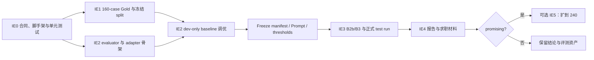

# Kindred Intent Bench 实施计划

> Status: `IE0 complete / IE1 complete and dataset frozen / IE2 complete / IE3 complete / IE4 complete`
>
> 日期：2026-08-23
>
> 权威设计：[design.md](design.md)

## 0. 目标与阶段边界

本计划把设计中的 IE0～IE4 转成一个**目标 9 个有效工作日、另留 2 天风险缓冲**的可执行 Pilot。首轮完成时，
仓库应能：

1. 校验版本化 taxonomy、Gold case、prediction 和 run manifest；
2. 在同一 160-case 数据集上运行 B0、B1、B2a、B2b、B3；
3. 离线重算指标、paired cluster bootstrap、混淆矩阵和 badcase；
4. 用冻结的确定函数输出 `promising / inconclusive / negative`；
5. 产出面向面试的 README、实验报告和可复现命令。

Pilot 不修改 Kindred，不读取真实 State、Thought 或用户消息，不执行 Activity/Capability，也不建设通用训练
平台、在线服务或 dashboard。IE5 的 240-case 扩展不进入首轮承诺。

## 1. 已冻结的工程决策

| 项目 | 决策 |
|---|---|
| 语言与包管理 | Python `>=3.10`、`uv`、`src` layout |
| 包与 CLI 名称 | Python package `intentbench`；命令 `intentbench` |
| 数据模型 | Pydantic；taxonomy 使用 YAML，case/prediction 使用 JSONL，结果使用 JSON/CSV/Markdown |
| 工程门检 | pytest、ruff、mypy；GitHub Actions 执行离线门检 |
| 仓库关系 | 不 import Kindred；只维护人工审核后的 taxonomy/context 静态快照 |
| 网络边界 | schema、evaluator、统计和报告完全离线；只有 LLM/embedding runner 可以访问 Provider |
| Provider 边界 | IE0 固定 primary/weak/cross-provider-reference/embedding 四个角色并做 dev-fixture smoke；只实现实际需要的窄 adapter |
| Secret | 只从环境变量读取；manifest 只记录配置名/hash，不记录 key、cookie 或原始环境变量 |
| 测试集边界 | 默认是 non-blind frozen test；正式 test 必须同时通过 dataset freeze 与 experiment lock hash 门禁 |
| 结果版本化 | 提交一组脱敏 reference run；临时 probe 和含 secret 的原始响应不进入 Git |

这些选择优先服务“短周期、可复现、方便面试讲解”，不提前抽象成通用 benchmark framework。

## 2. 目标目录

```text
kindred-intent-bench/
├── .github/workflows/ci.yml
├── .gitignore
├── pyproject.toml
├── uv.lock
├── README.md
├── configs/
│   ├── kindred-activity-grounding-v1.yaml
│   ├── kindred-activity-intents-v2.yaml
│   ├── kir-pilot-v2-annotation-pack.yaml
│   ├── kir-pilot-v1-experiment.yaml
│   └── provider-readiness.json
├── templates/
│   └── kir-pilot-v1-case.template.json
├── data/
│   └── kir-pilot-v2/
│       ├── candidates.jsonl
│       ├── candidate-card.md
│       ├── adjudicated/
│       │   ├── cases.jsonl
│       │   └── materialization-receipt.json
│       ├── dev.jsonl
│       ├── test.jsonl
│       ├── split-manifest.json
│       ├── dataset-card.md
│       ├── freeze-manifest.json
│       └── SHA256SUMS
├── prompts/
│   ├── b2a-one-stage/
│   ├── b2b-same-channel-verifier/
│   └── b3-evidence-then-grounding/
├── src/intentbench/
│   ├── annotation.py
│   ├── cli.py
│   ├── schemas.py
│   ├── taxonomy.py
│   ├── dataset.py
│   ├── review.py
│   ├── materialize.py
│   ├── split.py
│   ├── grounding.py
│   ├── runner.py
│   ├── evaluator.py
│   ├── metrics.py
│   ├── bootstrap.py
│   ├── verdict.py
│   ├── freeze.py
│   ├── reporting.py
│   └── adapters/
│       ├── base.py
│       ├── rule.py
│       ├── embedding.py
│       └── llm.py
├── experiments/
│   └── <run-id>/
│       ├── manifest.json
│       ├── predictions.jsonl
│       ├── metrics.json
│       ├── confusion.csv
│       ├── badcases.jsonl
│       ├── semantic-audit.csv
│       └── report.md
├── tests/
│   ├── fixtures/
│   ├── unit/
│   └── integration/
└── docs/
    ├── design.md
    ├── implementation-plan.md
    └── annotation-guideline.md
```

## 3. 实施顺序与阶段门



任何阶段没有通过 exit gate，不进入下一阶段。尤其不能以“先看看效果”为理由提前运行 frozen test。

## 4. Pilot 任务清单

### IE0：仓库脚手架、评测合同与 Provider readiness（第 1 天～第 2 天上午）

#### IE0.1 最小工程脚手架

- 建立 `pyproject.toml`、`src/intentbench`、pytest/ruff/mypy 配置与 `uv.lock`；
- 建立 `intentbench --help` 和 GitHub Actions 离线门检；
- 默认忽略 `.env`、临时响应、Provider cache 和未选定的实验输出。

#### IE0.2 Schema 与 taxonomy

- 实现 `Taxonomy`、`IntentDefinition`、`Case`、`Gold`、`Prediction`、`RunManifest`；
- 按设计中的 Gold/Prediction 真值表固定四类字段组合、nullable/forbidden 条件和 `reason_short` 长度；
- 只有 `in_scope` 允许唯一 `target_intent`；near-OOS 必须声明 sibling intents 和关联 contrast group；
- 校验 `evidence_quote` 是规范化 context 字段中的连续子串；
- 写入 8 个 Activity、定义、inclusion/exclusion、canonical examples 和 sibling intents；
- 校验 taxonomy/version、case id、受控枚举、candidate 和 target 一致性。

#### IE0.3 Evaluator 合同先行

- 先用小型 fixture 固定 `hierarchical_exact_match` 的定义；
- 用 Gold IDs 作为评测全集：missing/provider/schema-invalid 计错误并进入 `invalid` confusion 列；
  duplicate/extra prediction 使 run invalid；paired comparison 禁止取成功样本交集；
- 实现 HEM、最小 `metrics.py/evaluator.py`、三态 verdict 边界和单元测试，不等待真实模型结果；
- 固定关系图连通分量生成 `split_group_id`，并令 `bootstrap_cluster_id=split_group_id`；
- 实现最小 paired cluster bootstrap，固定 seed、迭代数、最少 8 cluster 和 `[L, U]` 格式；
- 固定 ID Macro-F1 样本域、`zero_division=0`、context/schema error count 和 token 差异公式；
- 实现 dataset freeze + experiment lock guard 的接口和拒绝路径测试。

#### IE0.4 Provider 与模型前置验证

- 在 experiment draft 中登记 primary、weak、cross-provider-reference 三个 LLM 角色，以及 embedding
  model、各自 adapter、结构化输出模式和环境变量名；
- 每个模型只使用单条 synthetic dev fixture 验证连接、超时、结构化输出和 identity；
- LLM smoke 必须确认 input/output token usage 可得；缺失时在进入 IE1 前更换 adapter 或明确预算合同不可行；
- 凭据跨环境时输出 partial records；合并器重新计算当前 experiment/fixture hash，逐角色核对模型合同，
  并校验四个角色无缺失、无重复；
- 输出不含 secret 的 `configs/provider-readiness.json`；不生成 test prediction，不做效果判断。

**Exit gate IE0**

```text
uv sync
uv run ruff check .
uv run mypy src
uv run pytest
uv run intentbench taxonomy validate configs/kindred-activity-intents-v1.yaml
uv run intentbench providers check --role <role> --fixture tests/fixtures/provider-smoke.json
uv run intentbench providers merge --config <experiment> --fixture <fixture> --input <partial> --input <partial>
```

前四项完全离线并全部通过；Provider check 是显式手动 smoke，成功结果只记录 capability/usage metadata。
schema、invalid policy、cluster/bootstrap、双 freeze guard 与 verdict 边界已有自动测试；没有 Kindred import。

### IE1：160-case Gold 数据（第 2 天下午～第 4 天）

#### IE1.1 标注规范与模板

- [x] 完成 `docs/annotation-guideline.md` 与 36 条非数据集机器示例；
- [x] 固定 evidence carrier、四类决策树、near/far OOS、ambiguous 与 no-intent 边界；
- [x] 固定 `scenario_family_id / contrast_group_id / paraphrase_cluster_id / source` 规则，以及 near-OOS 到
  sibling-ID 的关联规则；
- [x] 建立四类 decision 的正例、反例、仲裁例，8-intent inclusion/exclusion 和 near-OOS 配对；
- [x] 建立非数据集编写模板、离线 validator、分歧/仲裁合同和 dataset-card 限制声明。

IE1.1 的 guideline fixtures 使用 `guide-*` ID 且没有 case/split 身份，不计入 IE1.2 的 160 条 Gold。
执行 `uv run intentbench annotations validate` 可离线验证标注资产与 taxonomy 的一致性。

#### IE1.2 编写与复核数据

- [x] 建立 160 条 pre-split 候选：`in_scope=80`（8 intents × 10）；
- [x] `oos=32`：far 16 + near 16；
- [x] `no_intent=24`、`ambiguous=24`；
- [x] 满足 multi-turn、hard-negative、context-distractor/control、hypothesized weak-model probe、brandless XHS、rest/eat confusion
  的精确覆盖。
- [x] 以共享 schema 固定 DraftCase/Case 的 hard-negative、probe 语义，并用显式 perturbation 校验 context pair；
- [x] 建立 hash-bound、稳定乱序、4×40 的 label-blind initial review workspace 与可续跑 CLI；
- [x] 完成 160/160 initial blind label，并用 schema/hash/context 全量校验后原子回导 ReviewRecord；
- [x] 将人工标签与 `llm_assisted_draft_label` 的比较明确限定为 dataset QA，而非模型准确率；
- [x] 从 Mac 实际运行的 Kindred distribution 捕获 8 Activities / 15 Actions 的静态 grounding 快照；
- [x] 审计全部 160 条候选，确认 159 个草稿分层标签可保留、公开发布应映射到 `play_xiaohongshu`，旧
  `product_policy_required` 七项均可由运行时合同裁决；
- [x] 生成 `kindred-activity-intents-v2` 和 `kir-pilot-v2`，按完全相同 context 迁移 158 条人工标签；
- [x] 人工补审公开互动正例与私信 near-OOS 两条新增 context，并通过 hash-bound 工作簿导入 gate；
- [x] 基于完整 v2 review 重新生成 17 条受控分歧与 15 条一致抽查包；
- [x] 完成 grounded v2 仲裁，并以 candidate/taxonomy/grounding/response 四重 hash gate 导入 32 条 resolution；
- [x] 将 3 条 policy impact 拆为 routing Gold + `open_intent_candidate`，不污染执行感知 taxonomy；
- [x] 根据最终 routing 标签复核 semantic tags、hard-negative competitors、context pair 和关系 ID；
- [x] 写入 reviewer/adjudicator/label-source provenance，物化 160 条 adjudicated pre-split Gold；
- [x] IE1.3 分配 group-safe dev/test 后转换为正式 `Case` 并冻结。

每条 Gold 必须能从输入内审计 decision evidence；`gold.evidence_quote` 不传给 baseline。所有内容使用合成
或人工脱敏场景，不拷贝生产 State/Thought。

原始 `data/kir-pilot-v2/candidates.jsonl` 继续作为不可变 pending 候选证据；人工复核和仲裁后的 Gold 位于
`data/kir-pilot-v2/adjudicated/cases.jsonl`。该上游产物仍使用无 split 的 `AdjudicatedCase`；IE1.3 已只读
消费它，并按完整关系连通分量生成正式 `Case` dev/test，未回写候选、review 或 adjudicated Gold。

#### IE1.3 Group split 与冻结

- [x] 对共享 scenario/paraphrase/contrast id 的 case 建边，以连通分量生成唯一 `split_group_id`，并令
  `bootstrap_cluster_id=split_group_id`；`source` 只用于 provenance/stratification，不作为 group key；
- [x] 以完整 group 为原子，在 decision/intent/near-OOS 使用精确配额，在其余诊断切片使用确定性近似
  分层，得到 dev 48 / test 112；
- [x] 自动检测关系边和 group 的跨 split 泄漏，并验证正式 Case/taxonomy/evidence 合同；
- [x] 输出分布和 case/cluster 切片覆盖，生成 dataset card；
- [x] 记录 taxonomy、adjudicated Gold、materialization receipt、dev、test、split 和 dataset card 的 SHA-256；
- [x] 在 split/freeze manifest 预选 24 个 distinct-cluster semantic-preservation Case IDs；
- [x] 使用拒绝覆盖且可幂等再验证的写入策略；冻结后任何修订都创建新 dataset version，不覆盖
  `kir-pilot-v2`。

实际冻结结果：112 个关系连通分量分为 dev 35 / test 77 个 group；dev decision 为
`24/10/7/7`，八个 in-scope intent 各 3 条，near-OOS 5 条。full、Gold-in-scope、near-OOS、no-intent
四个 required test domain 分别有 77、43、11、11 个 bootstrap cluster。`test.jsonl` SHA-256 为
`648ebce7fd1fe9d9ce9699fd96f27948a1aa675fa4f8db1d73aa07bf4ef57fa5`。冻结过程没有生成 test prediction。

**Exit gate IE1**

- 160 条全部通过 schema、唯一 id、taxonomy target 和 evidence audit；
- 四类数量、8 个 intent 数量和横切标签覆盖符合设计；
- group leakage 检查为 0；
- Pilot verdict 所需的 full-test HEM、Gold-in-scope、near-OOS、no-intent 四个样本域各至少有 8 个 test
  bootstrap clusters，否则 IE1 不得冻结；
- dataset card 明确声明 non-blind frozen-test 限制；
- test hash 已写入 `freeze-manifest.json`，此前没有生成 test prediction。

### IE2：Evaluator、B0/B1/B2a（第 4～6 天）

#### IE2.1 确定性 evaluator

- [x] 实现 HEM、decision Macro-F1、ID intent Macro-F1、OOS/no-intent/ambiguous 指标和 per-intent recall；
- [x] 实现 near-OOS、sibling false reject、成对 context distractor、统一 slice metrics、schema invalid 等切片；
- [x] 所有诊断 tag 使用同一注册表输出 case/cluster/HEM/decision 指标，并补充 slot completeness、horizon accuracy
  与 quiet-control no-intent recall；
- [x] 实现按固定 label set、`zero_division=0` 和完整 Gold 全集计算的指标；
- [x] 实现按 `bootstrap_cluster_id` 的 paired draws、normalized confusion matrix 和确定性 badcase 选择；
- [x] evaluator 只消费缓存 prediction，重复计算不得调用 Provider；
- [x] 绑定 frozen dev/taxonomy 的 path 与 SHA-256，拒绝 test Case、漂移输入、partial overwrite 和非确定性重算；
- [x] 为四个 required domain 输出 `right-left` comparison；dev cluster 不足的 domain 保留 point estimate 并
  标记 `insufficient_clusters`，不违规退化为 case bootstrap。

IE2.1 实测 frozen dev cluster 数为：full 35、Gold-in-scope 21、near-OOS 5、no-intent 5。因此前两项可在
dev 生成诊断 CI，后两项的正式 CI 必须等待双冻结后的 test；该限制不影响 dev Prompt/threshold 比较的
point estimate，但不得包装成显著性结论。

#### IE2.2 B0 与 B1

- [x] B0 按冻结的 actionability → OOS → ambiguity → in-scope 顺序输出四类；
- [x] B1 使用 frozen embedding、taxonomy examples、受限 dev prototypes 和固定 gate 顺序；拒识 prototype
  先按 tag 分层、再按 bootstrap cluster 去重并取最小 case id，防止同簇样本重复加权；
- [x] Activity prototype 使用 normalize 后的 canonical-example centroid 与 cosine similarity；
- [x] 阈值在冻结网格上按 dev HEM、decision Macro-F1 依次最大化，仍相同时用参数 tuple 字典序打破平局；
- [x] 记录 prototype case id、阈值、embedding identity/version 和 adapter config hash；
- [x] 所有选择只在 dev 完成，禁止根据 test 补规则或替换 prototype；
- [x] 内容寻址 embedding cache 完成首次 81 个唯一文本填充，整套 B1 重跑已验证 0 Provider 调用且产物不变。

IE2.2 dev 结果：B0 HEM/Macro-F1=`1.0000/1.0000`；B1=`0.7708/0.6039`，选中
`tau_actionability=0.00, tau_oos_margin=0.00, tau_activity_min=0.30, tau_ambiguity=0.02`。B0 是在 dev
收窄后的 lexical 上界，不能解释为 test 泛化；B1-B0 full HEM paired-cluster dev CI 为
`[-0.3636,-0.1111]`，主要错误集中在 ambiguous/rejection gate。experiment v2 已回写 8 个 OOS 与 5 个
no-intent prototype IDs，但仍保持 draft，test 未运行。

#### IE2.3 B2a 与通用 runner

- [x] 定义窄 Provider Protocol、超时、重试、schema repair 与错误分类；schema 截断归入
  `schema_invalid`，且失败调用若已返回 usage，仍计入 token 和费用；
- [x] runner 统一记录 latency、input/output token、费用快照和 raw-response hash；
- [x] B2a 实现 one-stage/one-call，并只用 dev 选择 12 条类别平衡、bootstrap-cluster 去重的 few-shot 和
  Prompt；分别报告完整 dev、排除示例 ID 的 36-case 与排除全部示例 cluster 的 30-case 指标；
- [x] 不可变调用合同从真实 context、rendered Prompt、taxonomy、Prompt template、few-shot payload、response
  schema、model、adapter revision、structured-output mode、max output 和 generation parameters 自动算 hash，
  不依赖 case ID，也不信任调用者提交的独立 hash；
- [x] Provider success 与失败都可内容寻址缓存；整批重跑验证为 48 hits / 0 Provider calls / 输出
  `unchanged`；
- [x] B2a 缓存保留为 B2b call-1 的唯一输入来源；`require_existing` 在任一内容身份不一致或缓存缺失时
  硬失败，不允许悄悄回退到网络调用；脱敏 portable cache bundle 与 provenance 已进入 reference artifacts；
- [x] B2a/B2b call-1 共用结果规范化函数；Google、DeepSeek、OpenAI 对已返回响应的失败均先保存 billable
  usage，再映射 incomplete/schema/provider 状态。

IE2.3 先发现 `gemini-3.6-flash` 默认 medium thinking 会占满 512-token 单调用预算：首轮 48 条中 39 条
没有形成完整 JSON。单样本诊断后按 Provider 官方能力把分类任务固定为 `thinkingLevel=minimal`，仍保持
one call、512 max output、无 retry、无 schema repair；此时 Prompt v1 的 dev HEM/Macro-F1 为
`0.9375/0.9011`，排除 few-shot ID 后为 `0.9167/0.8293`，排除全部 few-shot cluster 后为
`0.9000/0.7639`。唯一一次 dev Prompt 修订只补充两个一般边界：
“比较/搜索/浏览/规划本身可构成当前行动”和“已有当前体验/方向但方式未定属于 ambiguous”。选定 Prompt v2
后，完整 dev、36-case ID-held-out 和 30-case cluster-held-out 的 HEM/Macro-F1 均为
`1.0000/1.0000`，0 schema/provider
failure；实际 input/output 为 `156556/3104` tokens，按 2026-08-22 价格快照估算 `$0.129057`，P50/P95
为 `1235.9/1879.6 ms`。

该结果只用于选择和冻结 dev 配置，不是 test 或生产泛化结论；Prompt v2 选定后不再继续按 dev 追分，test
仍未运行。与 B1 相比，B2a dev full-HEM 差值为 `+0.2292`，同一调参 dev 上的 selection-set descriptive
paired cluster 95% interval 为 `[+0.1111,+0.3636]`，不解释为泛化置信区间；near-OOS/no-intent 的 dev
cluster 不足，只保留 point estimate。缓存重跑只证明流水线复现，不证明模型重复采样稳定。

**Exit gate IE2**

- [x] metric golden tests、cluster bootstrap seed test、confusion/badcase snapshot tests 通过；
- [x] B0/B1/B2a 能完整跑 dev 并输出统一 prediction schema；
- [x] 重跑缓存结果不产生网络调用且 metrics 相同；
- [x] test 仍未用于阈值、Prompt、few-shot 或 prototype 选择。

### IE3：B2b/B3 公平消融与正式运行（第 6～7 天）

#### IE3.1 两个双调用实验臂

- [x] B2a/B2b/B3 使用相同 few-shot case IDs、顺序和数量；Prompt 表达可以适配各阶段，监督 case 不变；
- [x] B2b：call-1 必须直接复用相同 case/model/Prompt/config 的 B2a 缓存，call-2 才做同一闭集语义中的
  审查/修正；
- [x] B3-A：只恢复输入中已有的自由文本 evidence representation，不看 taxonomy；
- [x] B3-B：读取阶段 A 与完整 taxonomy，输出四类 routing decision；
- [x] 对齐模型、调用次数、每次 output budget、输入事实、解码参数、候选顺序、重试和 repair policy。

Gemini dev 已完成一次预登记结构修订并停止调 Prompt：B2b v2 为 47/48、无 schema invalid；B3 v2 为
48/48，且 48 条阶段 A 表达全部合法。两者总 token 为 309,138 / 245,110，绝对差约 20.7%，因此冻结前已
知严格 10% 预算门存在风险；不得用 dev 分数覆盖该有效性门。

#### IE3.2 Freeze 与运行

- [x] 在 test 前冻结 B0/B1 配置、三个 LLM Prompt、Provider 配置和 dependency lock；
- [x] 把模型角色、Prompt/config hash、预算和三态门写入新的 `kir-pilot-v2-ie3-experiment.yaml`，并绑定已冻结的
  v2 dataset manifest；
- 预登记 Gemini primary、DeepSeek weak 与 OpenAI cross-provider-reference；只有 primary 有全局 verdict
  authority，后两者只做各自模型内的 `B3-B2b` 复现；
- [x] 完整运行 Gemini dev sanity check 并按一次修订预算停止调 Prompt；
- [x] 在 experiment freeze 后对 frozen test 执行版本化 run；
- [x] `run --split test` 必须先验证 `freeze-manifest.json` 与 experiment lock 的全部 hash，任一缺失或不匹配就拒绝；
- [x] 报告 B2b/B3 实际总 token 差异；超过 10% 时自动标记 `budget-confounded`。

OpenAI 首次正式运行的 routing 请求因 Provider JSON Schema 子集不兼容全部返回 HTTP 400；原产物保留。
修复后按单独登记的 post-freeze recovery 协议复用成功的第一阶段缓存，只重跑两个 arm 的 routing call。
corrected B2b/B3 HEM 为 0.9911/0.9464，B3-B2b paired 95% interval 为
[-0.0940, -0.0087]；实际 token 差 19.46%，仍为 `budget-confounded`，且不改变 primary verdict。

**Exit gate IE3**

- B0/B1 各有一组 manifest；primary 的 B2a/B2b/B3 与两个复现角色的 B2b/B3 共七格都有 manifest 与
  prediction；
- 每个 case 的失败都显式记录，不因 parse/provider failure 静默丢弃；
- seven-run matrix checker、所有 B2b call-1 的 one-stage-compatible cache provenance 和双 freeze guard
  均通过；secondary 的 call-1 cache 不另计正式 B2a scoring arm；
- B2b/B3 预算合同可机器校验；
- 原始 test、Gold、Prompt 和 primary model 在看到结果后没有被修改。

### IE4：统计结论、报告与求职交付（第 7～9 天）

完成记录（2026-08-23）：缓存预测已重算为 schema v2 报告；24 个冻结 case × primary/weak 的 48 行
单人语义保真审计已完成并导出 CSV；单人 reviewer、post-label AI 机械 QA、无独立二审和无 pre-AI 快照
均在冻结过程披露中显式记录；简历 bullet 与 5/15 分钟讲法见 [interview-kit.md](interview-kit.md)。

#### IE4.1 自动报告

- 输出 metrics、95% paired cluster-bootstrap CI、confusion、badcases、latency/token/cost；
- 对预冻结的 24 条 slice，在 B3 primary/weak 上按 `action/object/horizon` rubric 记录
  `preserved/partial/lost`，共 48 行，生成 `semantic-audit.csv`；OpenAI reference 只保留自动指标；
  人工结果只作诊断，不进入三态 verdict，也不用于回调 Prompt；
- primary、weak 与 cross-provider-reference 分别报告，不平均、不投票；
- evaluator 按有效性 → negative → statistical inconclusive → promising 的冻结顺序生成结论；
- 所有表格由结构化结果生成，README 不手填与缓存不一致的数字。

#### IE4.2 面试材料

- README 首屏说明问题、边界、方法、关键数字、复现命令和真实限制；
- 生成 5 分钟与 15 分钟项目讲法；
- 只有完成实验后才填写简历 bullet 中的数字；
- negative/inconclusive 也如实解释其工程价值，不重采样或改 test 追求正结果。

**Exit gate IE4 / Pilot Definition of Done**

- fresh clone 能安装并执行离线门检；
- 使用已缓存 prediction 能重算完全相同的结构化指标和 verdict；
- 160-case 数据、五个 baseline、三 LLM 角色、CI、badcase、延迟与成本均有可审计产物；
- 24-case × primary/weak 的 semantic-preservation audit 有冻结 IDs、rubric 和 48 行记录；OpenAI
  reference 不增加人工 audit；
- 仓库不包含 secret、生产数据或对 Kindred 的运行时依赖；
- 报告明确说明 synthetic、balanced、non-blind portfolio pilot 的外推限制。

## 5. 测试策略

| 测试层 | 必测内容 |
|---|---|
| Schema unit | 四类字段真值表、evidence 子串、near-OOS sibling、未知 target、重复 id、版本错误 |
| Metric unit | invalid/missing、固定 label、缺类、HEM、Macro-F1、OOS、ambiguous、切片指标 |
| Verdict unit | 每个 CI 边界、token 10% 分母/失败调用、最少 cluster、缺字段和合同失效 |
| Split/bootstrap unit | 关系图连通分量、source 非 group key、paired draws、单 cluster 与跨 split 泄漏 |
| Freeze guard | dataset/experiment lock 缺失、hash mismatch 和合法 test run |
| Adapter contract | 调用次数、预算、重试、repair、candidate order 与错误映射 |
| Cache integration | 内容/taxonomy/Prompt/config 任一 hash 变化导致 miss；B2b call-1 provenance 指向 B2a |
| Matrix integration | primary 三臂 + 两个复现角色各两臂，共七格齐全；缺一格不得生成正式报告 |
| Report snapshot | 指标、confusion、badcase 和 manifest 引用一致 |
| Privacy check | fixtures/results 不包含已知 secret pattern 或 Kindred 生产路径内容 |

Provider live tests 默认不进入普通 CI；使用显式 marker 手动运行，避免 CI 消耗费用或因外部波动失败。

## 6. 提交与交付节奏

建议每个提交都可独立通过离线门检：

1. `chore: bootstrap python workbench`
2. `feat: define taxonomy and evaluation schemas`
3. `data: add annotated pilot dataset`
4. `feat: implement deterministic evaluator`
5. `feat: add rule and embedding baselines`
6. `feat: add llm runner and one-stage baseline`
7. `feat: add matched two-call ablation`
8. `report: publish frozen pilot results`

不要把 160 条数据、全部 adapter 和最终报告压成一个不可审查的大提交。只有第 8 个提交允许引用正式 test
结果；前七个提交的调试输出只能来自 fixtures 或 dev。

## 7. 风险与应对

| 风险 | 预防与处理 |
|---|---|
| 单人编写 test 导致记忆泄漏 | 明确 non-blind；先冻结 hash；结果不包装成无偏 benchmark |
| 160 条使 CI 太宽 | 按合同判 inconclusive；不临时改门槛；另开 power-analysis proposal 才能扩样 |
| B1 得到更多人工监督 | 限制 prototype 来源/数量并报告 case id；所有方法只用同一 dev pool |
| 双阶段收益来自更多 token | B2b 双调用对照；记录真实 token；差异超过 10% 判 budget-confounded |
| Provider 响应不可复现 | 固定各 Provider 版本/参数/hash并缓存 normalized response；只声称 evaluator 可复现 |
| 生成数据过于模板化 | 使用 scenario/contrast/paraphrase cluster，做泄漏和 slice coverage 检查 |
| 项目膨胀成平台 | Pilot 只实现五个 baseline 与离线报告；IE5、训练、Shadow、dashboard 全部后置 |
| 9 天排期没有余量 | 对外目标 9 天，计划预留 2 天风险缓冲；不以删除公平对照换进度 |

仓库目前是 private，因此 IE0 不仓促选择 LICENSE。准备公开作品集前必须完成数据/依赖许可复核，再选择
明确 LICENSE；未完成前保持 private，不把“没有许可证”误解成默认允许复用。

## 8. IE5 触发条件

只有 primary model 的 Pilot verdict 为 `promising`，才进入 IE5：

- 新增 80 条至 240；
- 至少 25% 独立双标，或诚实报告 test-retest；
- 扩大 cluster 后继续 bootstrap；
- 增加重复稳定性和更完整弱模型矩阵；
- 重新应用 IE-V1 的生产讨论门。

IE5 仍不修改 Kindred。sampled Shadow 必须另写生产 proposal，并单独获得授权。

## 9. 第一实施切片

计划获批后，只启动 **IE0**，不同时开始造 160 条数据或运行效果实验。只允许每个预选模型各一次
dev-fixture readiness smoke。第一实施切片指“第一批必须一起落地并通过 Exit Gate 的文件集合”，完成物是：

```text
pyproject.toml
uv.lock
.gitignore
.github/workflows/ci.yml
README.md
src/intentbench/{cli,schemas,taxonomy,b1,evaluator,metrics,bootstrap,verdict,freeze,providers}.py
src/intentbench/adapters/{base,google,deepseek,openai}.py
configs/{kindred-activity-intents-v1.yaml,kir-pilot-v1-experiment.yaml,provider-readiness.json}
tests/unit/
tests/fixtures/provider-smoke.json
docs/annotation-guideline.md（骨架）
GitHub Actions 离线门检
```

IE0 通过后再进入 IE1。这样可以在 Gold 编写前发现 schema、标签边界和 verdict 合同问题，避免后续批量返工。
