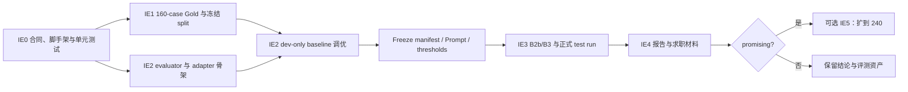

# Kindred Intent Bench 实施计划

> Status: `proposed / ready for review`
>
> 日期：2026-08-20
>
> 权威设计：[design.md](design.md)

## 0. 目标与阶段边界

本计划把设计中的 IE0～IE4 转成一个 **7～9 个有效工作日**的可执行 Pilot。首轮完成时，仓库应能：

1. 校验版本化 taxonomy、Gold case、prediction 和 run manifest；
2. 在同一 160-case 数据集上运行 B0、B1、B2a、B2b、B3；
3. 离线重算指标、paired cluster bootstrap、混淆矩阵和 badcase；
4. 用冻结的确定函数输出 `promising / inconclusive / negative`；
5. 产出面向面试的 README、实验报告和可复现命令。

Pilot 不修改 Kindred，不读取真实 State、Thought 或用户消息，不执行 Activity/Capability，也不建设通用训练
平台、在线服务或 dashboard。IE5 的 240-case 扩展不进入首轮承诺。

## 1. 已冻结的工程决策

| 项目 | 决策 |
|---|---|
| 语言与包管理 | Python `>=3.10`、`uv`、`src` layout |
| 包与 CLI 名称 | Python package `intentbench`；命令 `intentbench` |
| 数据模型 | Pydantic；taxonomy 使用 YAML，case/prediction 使用 JSONL，结果使用 JSON/CSV/Markdown |
| 工程门检 | pytest、ruff、mypy；GitHub Actions 执行离线门检 |
| 仓库关系 | 不 import Kindred；只维护人工审核后的 taxonomy/context 静态快照 |
| 网络边界 | schema、evaluator、统计和报告完全离线；只有 LLM/embedding runner 可以访问 Provider |
| Provider 边界 | 定义窄 `LLMClient`/`EmbeddingClient` Protocol；首轮只实现实验实际需要的 adapter |
| Secret | 只从环境变量读取；manifest 只记录配置名/hash，不记录 key、cookie 或原始环境变量 |
| 测试集边界 | 默认是 non-blind frozen test；冻结前 runner 只开放 dev，正式 test 运行必须携带 frozen manifest |
| 结果版本化 | 提交一组脱敏 reference run；临时 probe 和含 secret 的原始响应不进入 Git |

这些选择优先服务“短周期、可复现、方便面试讲解”，不提前抽象成通用 benchmark framework。

## 2. 目标目录

```text
kindred-intent-bench/
├── .github/workflows/ci.yml
├── .gitignore
├── pyproject.toml
├── uv.lock
├── README.md
├── configs/
│   ├── kindred-activity-intents-v1.yaml
│   └── kir-pilot-v1-experiment.yaml
├── data/
│   └── kir-pilot-v1/
│       ├── dev.jsonl
│       ├── test.jsonl
│       ├── dataset-card.md
│       ├── freeze-manifest.json
│       └── SHA256SUMS
├── prompts/
│   ├── b2a-one-stage/
│   ├── b2b-same-channel-verifier/
│   └── b3-evidence-then-grounding/
├── src/intentbench/
│   ├── cli.py
│   ├── schemas.py
│   ├── taxonomy.py
│   ├── dataset.py
│   ├── runner.py
│   ├── evaluator.py
│   ├── metrics.py
│   ├── bootstrap.py
│   ├── verdict.py
│   ├── reporting.py
│   └── adapters/
│       ├── base.py
│       ├── rule.py
│       ├── embedding.py
│       └── llm.py
├── experiments/
│   └── <run-id>/
│       ├── manifest.json
│       ├── predictions.jsonl
│       ├── metrics.json
│       ├── confusion.csv
│       ├── badcases.jsonl
│       └── report.md
├── tests/
│   ├── fixtures/
│   ├── unit/
│   └── integration/
└── docs/
    ├── design.md
    ├── implementation-plan.md
    └── annotation-guideline.md
```

## 3. 实施顺序与阶段门



任何阶段没有通过 exit gate，不进入下一阶段。尤其不能以“先看看效果”为理由提前运行 frozen test。

## 4. Pilot 任务清单

### IE0：仓库脚手架与评测合同（第 1 天）

#### IE0.1 最小工程脚手架

- 建立 `pyproject.toml`、`src/intentbench`、pytest/ruff/mypy 配置与 `uv.lock`；
- 建立 `intentbench --help` 和 GitHub Actions 离线门检；
- 默认忽略 `.env`、临时响应、Provider cache 和未选定的实验输出。

#### IE0.2 Schema 与 taxonomy

- 实现 `Taxonomy`、`IntentDefinition`、`Case`、`Gold`、`Prediction`、`RunManifest`；
- 固定四类互斥 decision 和字段组合：只有 `in_scope` 允许唯一 `target_intent`；
- 写入 8 个 Activity、定义、inclusion/exclusion、canonical examples 和 sibling intents；
- 校验 taxonomy/version、case id、受控枚举、candidate 和 target 一致性。

#### IE0.3 Evaluator 合同先行

- 先用小型 fixture 固定 `hierarchical_exact_match` 的定义；
- 实现三态 verdict 的边界表和单元测试，不等待真实模型结果；
- 固定 cluster bootstrap seed、迭代数和 `[L, U]` 序列化格式；
- 明确 schema-invalid、缺失 prediction 和重复 case id 的失败策略。

**Exit gate IE0**

```text
uv sync
uv run ruff check .
uv run mypy src
uv run pytest
uv run intentbench taxonomy validate configs/kindred-activity-intents-v1.yaml
```

上述命令全部通过；schema 与 verdict 边界已有自动测试；没有 Kindred import 或网络依赖。

### IE1：160-case Gold 数据（第 2～4 天）

#### IE1.1 标注规范与模板

- 完成 `docs/annotation-guideline.md`；
- 固定 evidence carrier、四类决策树、near/far OOS、ambiguous 与 no-intent 边界；
- 固定 `scenario_family_id / contrast_group_id / paraphrase_cluster_id / source` 规则；
- 建立正例、反例和需要仲裁的示例。

#### IE1.2 编写与复核数据

- `in_scope=80`：8 intents × 10；
- `oos=32`：far 16 + near 16；
- `no_intent=24`；
- `ambiguous=24`；
- 满足 multi-turn、hard-negative、context-distractor、weak-model trap、brandless XHS、rest/eat confusion
  的最低覆盖。

每条 Gold 必须能从输入内审计 decision evidence；`gold.evidence_quote` 不传给 baseline。所有内容使用合成
或人工脱敏场景，不拷贝生产 State/Thought。

#### IE1.3 Group split 与冻结

- 按 scenario/source/paraphrase cluster 分组得到 dev 48 / test 112；
- 自动检测相同或归一化文本、cluster、contrast group 的跨 split 泄漏；
- 输出分布和切片覆盖，生成 dataset card；
- 记录 taxonomy、dev、test 的 SHA-256；
- 冻结后任何修订都创建新 dataset version，不覆盖 `kir-pilot-v1`。

**Exit gate IE1**

- 160 条全部通过 schema、唯一 id、taxonomy target 和 evidence audit；
- 四类数量、8 个 intent 数量和横切标签覆盖符合设计；
- group leakage 检查为 0；
- dataset card 明确声明 non-blind frozen-test 限制；
- test hash 已写入 `freeze-manifest.json`，此前没有生成 test prediction。

### IE2：Evaluator、B0/B1/B2a（第 4～6 天）

#### IE2.1 确定性 evaluator

- 实现 HEM、decision Macro-F1、ID intent Macro-F1、OOS/no-intent/ambiguous 指标和 per-intent recall；
- 实现 near-OOS、sibling false reject、context distractor、schema invalid 等切片；
- 实现 paired cluster bootstrap、normalized confusion matrix 和确定性 badcase 选择；
- evaluator 只消费缓存 prediction，重复计算不得调用 Provider。

#### IE2.2 B0 与 B1

- B0 按冻结的 actionability → OOS → ambiguity → in-scope 顺序输出四类；
- B1 使用 frozen embedding、taxonomy examples、受限 dev prototypes 和固定 gate 顺序；
- 记录 prototype case id、阈值、embedding identity/version 和 adapter config hash；
- 所有选择只在 dev 完成，禁止根据 test 补规则或替换 prototype。

#### IE2.3 B2a 与通用 runner

- 定义窄 Provider Protocol、超时、重试、schema repair 与错误分类；
- runner 统一记录 latency、input/output token、费用快照和 raw-response hash；
- B2a 实现 one-stage/one-call，并只用 dev 选择 few-shot 和 Prompt；
- 缓存层以 case/model/Prompt/config hash 为 key，支持离线重算。

**Exit gate IE2**

- metric golden tests、cluster bootstrap seed test、confusion/badcase snapshot tests 通过；
- B0/B1/B2a 能完整跑 dev 并输出统一 prediction schema；
- 重跑缓存结果不产生网络调用且 metrics 相同；
- test 仍未用于阈值、Prompt、few-shot 或 prototype 选择。

### IE3：B2b/B3 公平消融与正式运行（第 6～7 天）

#### IE3.1 两个双调用实验臂

- B2b：第一次闭集决策，第二次在同一闭集语义中审查/修正；
- B3-A：只恢复输入中已有的自由文本 evidence representation，不看 taxonomy；
- B3-B：读取阶段 A 与完整 taxonomy，输出四类 routing decision；
- 对齐模型、调用次数、每次 output budget、输入事实、解码参数、候选顺序、重试和 repair policy。

#### IE3.2 Freeze 与运行

- 在 test 前冻结 B0/B1 配置、三个 LLM Prompt、Provider 配置和 dependency lock；
- 把模型角色、Prompt/config hash、预算和三态门写入 `kir-pilot-v1-experiment.yaml`；
- 预登记一个 `primary_decision_model`，另一个模型只作为弱模型切片；
- 先完整运行 dev sanity check，再对 frozen test 执行版本化 run；
- 报告 B2b/B3 实际总 token 差异；超过 10% 时自动标记 `budget-confounded`。

**Exit gate IE3**

- B0～B3 在同一 frozen test 上各有 manifest 与 prediction；
- 每个 case 的失败都显式记录，不因 parse/provider failure 静默丢弃；
- B2b/B3 预算合同可机器校验；
- 原始 test、Gold、Prompt 和 primary model 在看到结果后没有被修改。

### IE4：统计结论、报告与求职交付（第 7～9 天）

#### IE4.1 自动报告

- 输出 metrics、95% paired cluster-bootstrap CI、confusion、badcases、latency/token/cost；
- primary model 与弱模型分别报告，不平均；
- evaluator 按有效性 → negative → statistical inconclusive → promising 的冻结顺序生成结论；
- 所有表格由结构化结果生成，README 不手填与缓存不一致的数字。

#### IE4.2 面试材料

- README 首屏说明问题、边界、方法、关键数字、复现命令和真实限制；
- 生成 5 分钟与 15 分钟项目讲法；
- 只有完成实验后才填写简历 bullet 中的数字；
- negative/inconclusive 也如实解释其工程价值，不重采样或改 test 追求正结果。

**Exit gate IE4 / Pilot Definition of Done**

- fresh clone 能安装并执行离线门检；
- 使用已缓存 prediction 能重算完全相同的结构化指标和 verdict；
- 160-case 数据、五个 baseline、主/弱模型、CI、badcase、延迟与成本均有可审计产物；
- 仓库不包含 secret、生产数据或对 Kindred 的运行时依赖；
- 报告明确说明 synthetic、balanced、non-blind portfolio pilot 的外推限制。

## 5. 测试策略

| 测试层 | 必测内容 |
|---|---|
| Schema unit | 四类合法/非法字段组合、未知 taxonomy target、重复 id、版本错误 |
| Metric unit | 手工可算 fixture 的 HEM、Macro-F1、OOS、ambiguous、切片指标 |
| Verdict unit | 每个 CI 边界、token 10% 边界、缺字段和合同失效的互斥结果 |
| Split unit | scenario/source/paraphrase/contrast 跨 split 泄漏 |
| Adapter contract | 调用次数、预算、重试、repair、candidate order 与错误映射 |
| Cache integration | 首次调用写缓存；离线重算不访问网络；hash 变化导致 cache miss |
| Report snapshot | 指标、confusion、badcase 和 manifest 引用一致 |
| Privacy check | fixtures/results 不包含已知 secret pattern 或 Kindred 生产路径内容 |

Provider live tests 默认不进入普通 CI；使用显式 marker 手动运行，避免 CI 消耗费用或因外部波动失败。

## 6. 提交与交付节奏

建议每个提交都可独立通过离线门检：

1. `chore: bootstrap python workbench`
2. `feat: define taxonomy and evaluation schemas`
3. `data: add annotated pilot dataset`
4. `feat: implement deterministic evaluator`
5. `feat: add rule and embedding baselines`
6. `feat: add llm runner and one-stage baseline`
7. `feat: add matched two-call ablation`
8. `report: publish frozen pilot results`

不要把 160 条数据、全部 adapter 和最终报告压成一个不可审查的大提交。只有第 8 个提交允许引用正式 test
结果；前七个提交的调试输出只能来自 fixtures 或 dev。

## 7. 风险与应对

| 风险 | 预防与处理 |
|---|---|
| 单人编写 test 导致记忆泄漏 | 明确 non-blind；先冻结 hash；结果不包装成无偏 benchmark |
| 160 条使 CI 太宽 | 按合同判 inconclusive；不临时改门槛；另开 power-analysis proposal 才能扩样 |
| B1 得到更多人工监督 | 限制 prototype 来源/数量并报告 case id；所有方法只用同一 dev pool |
| 双阶段收益来自更多 token | B2b 双调用对照；记录真实 token；差异超过 10% 判 budget-confounded |
| Provider 响应不可复现 | 固定版本/参数/hash并缓存 normalized response；只声称 evaluator 可复现 |
| 生成数据过于模板化 | 使用 scenario/contrast/paraphrase cluster，做泄漏和 slice coverage 检查 |
| 项目膨胀成平台 | Pilot 只实现五个 baseline 与离线报告；IE5、训练、Shadow、dashboard 全部后置 |

## 8. IE5 触发条件

只有 primary model 的 Pilot verdict 为 `promising`，才进入 IE5：

- 新增 80 条至 240；
- 至少 25% 独立双标，或诚实报告 test-retest；
- 扩大 cluster 后继续 bootstrap；
- 增加重复稳定性和更完整弱模型矩阵；
- 重新应用 IE-V1 的生产讨论门。

IE5 仍不修改 Kindred。sampled Shadow 必须另写生产 proposal，并单独获得授权。

## 9. 第一实施切片

计划获批后，只启动 **IE0**，不同时开始造 160 条数据或调用 LLM。第一切片的完成物是：

```text
pyproject.toml
uv.lock
src/intentbench/{cli,schemas,taxonomy,verdict}.py
configs/kindred-activity-intents-v1.yaml
tests/unit/
docs/annotation-guideline.md（骨架）
GitHub Actions 离线门检
```

IE0 通过后再进入 IE1。这样可以在 Gold 编写前发现 schema、标签边界和 verdict 合同问题，避免后续批量返工。
